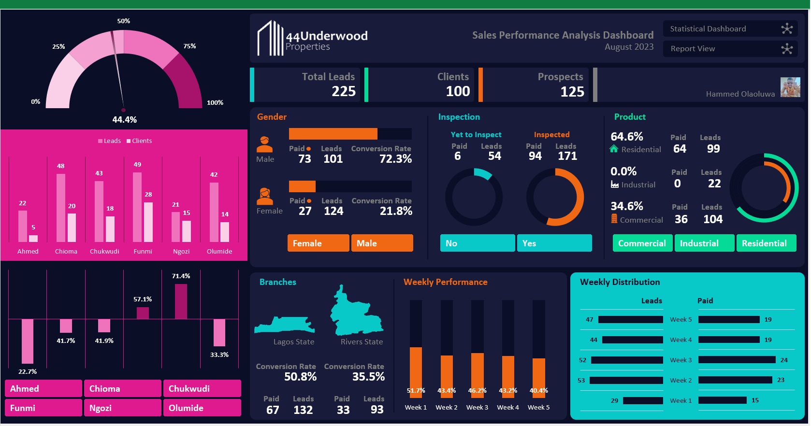

## ABOUT ME
Hi! I'm Ola. I'm a data analyst who loves using data to help businesses grow. I have experience in sales, operations, finance, and customer service, and I enjoy solving problems to help companies succeed.

## SKILLS

**✅ Technical Skills**  
Advanced Excel | Power BI | Python | SQL

**✅ Analytical Skills**  
Data Cleaning & Preparation | Predictive Modelling & Statistical Analysis | Data Analysis & Interpretation | Data Visualization & Dashboard Creation

**✅ Soft Skills**  
Communication | Problem-Solving | Attention to detail | Collaboration | Time Management | Critical Thinking  

## MY PORTFOLIO 
*A glimpse of some of the projects I've been working on.*

**Analysis of Sales System Dynamics for 44 Underwood Properties**

In August 2023, the owner of 44 Underwood Properties faced a pressing challenge: a noticeable decline in sales. This situation raised important questions about team performance and the root causes of the downturn. To uncover the answers, a thorough analysis was undertaken, revealing key insights that could significantly enhance their sales strategy.

  
[View Project](https://(https://mega.nz/folder/FskUDKwT#MJ7LCyWO1klu9QgsOwJbPA)/)

**Branch Performance Analysis for Vintage Cars Ltd.**

The mission was to provide an insightful business analysis for a leading car retail company operating across six states in Nigeria. The objective focused on evaluating branch performance in terms of sales, customer demographics, geography, and product.

[Read More](https://www.linkedin.com/pulse/predictive-modeling-hypothesis-testing-using-titanic-dataset-anietie/)

**Predictive Modeling for Employee Retention**

This project analyzes HR and employee data to identify predictors of attrition. The objective was to develop predictive models that help reduce turnover and improve employee retention.

  

  
[Read More](https://www.linkedin.com/pulse/predictive-modeling-hypothesis-testing-using-titanic-dataset-anietie/)

## MY EDUCATION
Federal University Oye Ekiti, Ekiti State, Nigeria  
B.Eng. Computer Engineering  (2014-2019) | [Certificate](https://drive.google.com/file/d/164QECeWFPIa7Ome2VXdSVp8Dy26qdErQ/view?usp=sharing)

## CONTACT DETAILS
*Let’s connect and see how we can make a difference together!*
<table>
  <tbody>
    <tr>
      <td>📧</td>
      <td><a href="mailto:hammedolaoluwa969@gmail.com">hammedolaoluwa969@gmail.com</a></td>
    </tr>
    <tr>
      <td>📞</td>
      <td>(234) 915-558-9725</td>
    </tr>
    <tr>
      <td>📍</td>
      <td>Oyo, Nigeria</td>
    </tr>
    <tr>
      <td>🌐</td>
      <td><a href="www.linkedin.com/in/hammedolaoluwa">My Daily LinkedIn Practices</a></td>
    </tr>
